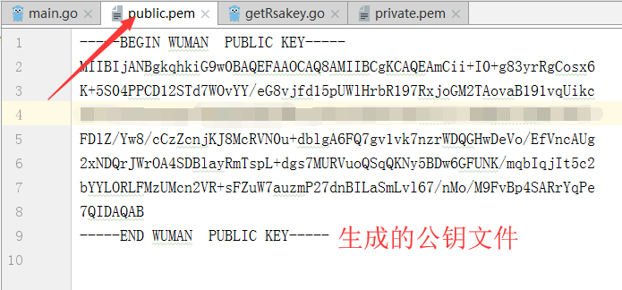
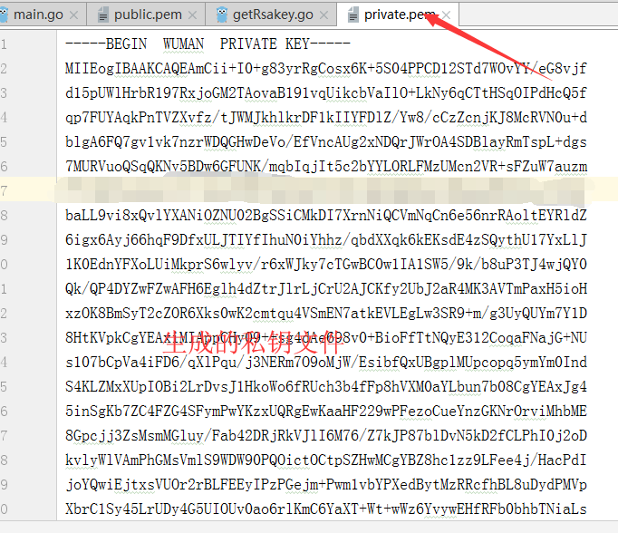

# wmgocrypt
go语言封装的各种对称加密和非对称加密，可以直接使用，包括3重DES，AES的CBC和CTR模式，还有RSA非对称加密

下载到本地可以直接调用

使用方法

```
go get github.com/wumansgy/wmgocrypt
```

然后下载到本地可以直接调用，包括了DES的CBC模式的加密解密（虽然DES早就被破解，但是可以参考使用），三重DES的加密解密（可以使用），AES的CBC模式和CTR模式（对称加密中常用的加密算法），非对称加密RSA的加密解密（比较常用的非对称加密算法），椭圆曲线加密算法（后面更新），还有哈希函数sha256，sha512的快速使用（MD5，SHA1已经在2004，2005年被陆续攻破，现在常用sha256和sha512）

#### DES的快速使用

```
func main(){
	plaintext := []byte("床前明月光，疑是地上霜，举头望明月，学习go语言")//明文
	fmt.Println("明文为：",string(plaintext))

	//传入明文和自己定义的密钥，密钥为8字节，如果不足8字节函数内部自动补全，超过8字节函数内部截取
	cryptText := des.DesCBC_Encrypt(plaintext, []byte("asd12345")) //得到密文
	fmt.Println("DES的CBC模式加密后的密文为:", base64.StdEncoding.EncodeToString(cryptText))

	//传入密文和自己定义的密钥，需要和加密的密钥一样，不一样会报错，8字节，如果不足8字节函数内部自动补全，超过8字节函数内部截取
	newplaintext := des.DesCBC_Decrypt(cryptText, []byte("asd12345"))  //解密得到密文

	fmt.Println("DES的CBC模式解密完：", string(newplaintext))
}
```


#### 三重DES的快速使用

```
func main(){
	plaintext := []byte("床前明月光，疑是地上霜，举头望明月，学习go语言")
	fmt.Println("明文为：",string(plaintext))

	//传入明文和自己定义的密钥，密钥为24字节，如果不足24字节函数内部自动补全，不过超过24字节函数内部截取
	cryptText := des.TripleDesEncrypt(plaintext, []byte("wumansgy12345678asdfghjk"))
	fmt.Println("三重DES的CBC模式加密后的密文为:", base64.StdEncoding.EncodeToString(cryptText))

	//传入密文和自己定义的密钥，需要和加密的密钥一样，不一样会报错，24字节，如果不足24字节函数内部自动补全，超过24字节函数内部截取
	newplaintext := des.TripleDesDecrypt(cryptText, []byte("wumansgy12345678asdfghjk"))

	fmt.Println("三重DES的CBC模式解密完：", string(newplaintext))
}
```


#### AES的CBC模式的快速使用

```
func main(){
	plaintext := []byte("床前明月光，疑是地上霜，举头望明月，学习go语言")
	fmt.Println("明文为：",string(plaintext))

	//传入明文和自己定义的密钥，密钥为16字节，如果不足16字节函数内部自动补全，超过16字节函数内部截取
	cryptText := aes.AesCBC_Encrypt(plaintext, []byte("wumansgygoaescry"))
	fmt.Println("AES的CBC模式加密后的密文为:", base64.StdEncoding.EncodeToString(cryptText))

	//传入密文和自己定义的密钥，需要和加密的密钥一样，不一样会报错，16字节，如果不足16字节函数内部自动补全，超过16字节函数内部截取
	newplaintext := aes.AesCBC_Decrypt(cryptText, []byte("wumansgygoaescry"))

	fmt.Println("AES的CBC模式解密完：", string(newplaintext))
}
```


#### AES的CTR模式的快速使用

```
func main(){
	plaintext := []byte("床前明月光，疑是地上霜，举头望明月，学习go语言")
	fmt.Println("明文为：",string(plaintext))

	//传入明文和自己定义的密钥，密钥为16字节，如果不足16字节函数内部自动补全，超过16字节函数内部截取
	cryptText := aes.AesCTR_Encrypt(plaintext, []byte("wumansgygoaesctr"))
	fmt.Println("AES的CTR模式加密后的密文为:", base64.StdEncoding.EncodeToString(cryptText))

	//传入密文和自己定义的密钥，需要和加密的密钥一样，不一样会报错，16字节，如果不足16字节函数内部自动补全，超过16字节函数内部截取
	newplaintext := aes.AesCTR_Decrypt(cryptText, []byte("wumansgygoaesctr"))

	fmt.Println("AES的CTR模式解密完：", string(newplaintext))
}
```


#### 非对称加密RSA的快速使用

##### 非对称加密需要先生成一对公钥和私钥，公钥和私钥是成对出现的，公钥加密只能私钥解密，私钥加密只能公钥解密

##### 使用

先直接调用GetKet()就可以在本地生成一个私钥文件，一个公钥文件

```
func main() {
	rsa.GetKey()
}
```






#### 加解密使用

```
func main() {
	plaintext := []byte("床前明月光，疑是地上霜,举头望明月，低头学编程")
	//把生成的文件里面复制过来，头和尾也需要，用反引号包含起来
	privatekey := []byte(`-----BEGIN  wuman private key-----
MIIEpAIBAAKCAQEAzwD90zCxWsoV7in9XifMYqZlWM9FUcbDDMqgYQJ06IAT+DJb
w9yMdlw/bWYZ6usDkaKoShauXhafcWME0N6rRubRfYT5K0Ye1pav+7HyEBOBihvW
Cc6XzOCd4Z5Zws9/ustqzdTTFQDrXDJGNZ1I0PVa6ERYJFyFkyaIuhM1P29yat6/
zWmkvkz91E6cJyLEKSbuWLeSz0zqYur77/+c+A/xg9IimPjimwxFB/pjieBwDsq8
/PRDfxgezhVCgZikKexp7fl4yEbqxrPbQgNwad6gP18x4SD9oHZEkQsMHADpGK57
k6tNkxnnB+AlAjXOuzwXh/8Q0vN9FsSW++hW/wIDAQABAoIBABMSTlBkzhJFSBv3
Nma0V/pGxlOWVRahr1rAWGJXrZm2IyDc0uOKsE4/VYCoxX6FRIDocYTR7iKxBuOV
cd4khbc0kNx1oddA0JqIq5IO5PRiN68XvXKN3CJ+F02wHyj5oRT+pMpt7zyiJw0J
fLp30TufP07i7RP8ijnydOpf1qoPWd/v4RLvx4RvrcYI/QmQYLmC0XqbzRIJtn8y
NwVSv/GbPznl7q0th2kkSpa2qgMU3KgiC5ojaHKgI0zQuYfh7Z9HSAypMi7NJp4e
UMwhAQYIlKshH94+wUo4gu4Xy52e+mh1HMhM/CDBWguyQ6xXBrvfZ0vnbxaMaAuI
yk/unNECgYEA/1J65iLIp3kbHPwtxrG5NF9KM+ArAxRjkRyQynzg05n2en/4/q6I
KJJc2/bBnS1XuZsPcRTVnaaGIEvFykC5kW0m0y5K9Xtzj6gaU/yxIc9v6iMDeEbi
Vp5/mttCTbHWQpGv81Nm3uXPU8QUsz5GkMyecq5fEr3psLpMhnI/k00CgYEAz42s
elImcH/Sulvej/yv7ivn9t7CVf2c7LJv+gMy6hV2nufQ+bmWxnh1lz0X19ccxzMW
S04r754JOI3Xd+Ny5OVvjJNdfyUrUHdXhJ+NnZbjRskY3P1CqFKysTs5BsVMJNAb
52rYTIPZFXetSJ0RdD+XJl0HO3m2gM9q18dEVXsCgYAF0gWHNYfJeZNKp90LSIXm
Ub3JTPTuDwruBe6vDwW5DSt3Q2+Trrrf4eZIBWoIgT4ctxI1C7qK637nQZLyt2MD
k69s5QNEcVoDDlv7SilnkekFN2Me3M7QFrDmANWUG9e8kMGoFGCl+Csvx6qJI4RM
TL3X822rabToGHciIXydiQKBgQC1bDtluMVM9Q54Q7Gp3tDRuaNL0a/BhqxS4i6r
NXydzSEhCbVLdIRs/AKdrpNW4fuPzAIi1TPmghfBTYsYisJ1fnAhSvchGpZgAdGI
ZgddxvTnfQS0ttQ7Wf5EmWXhmzhRvW+Gu4hSabWp5DCeFl2ZZbRznkGiJWP3+FaG
QvJiXQKBgQCKAI0z3LHCam8HfxO2Wh3XHahUOcCIeLW/rpYGBBLEX7e2/KAG9j1h
WETHrMwZieNcwXPC6BIf1dpq7uAgLCStHuEdf4RK4GkcObu9+Da8pJ7JMz+6Up+c
MHF5Er1BJwsLFlc1TXMRnj49hoK1k5YhGwd2jhWhvGNF562zYtaZSA==
-----END  wuman private key-----
`)
	publickey := []byte(`-----BEGIN wuman public key-----
MIIBIjANBgkqhkiG9w0BAQEFAAOCAQ8AMIIBCgKCAQEAzwD90zCxWsoV7in9XifM
YqZlWM9FUcbDDMqgYQJ06IAT+DJbw9yMdlw/bWYZ6usDkaKoShauXhafcWME0N6r
RubRfYT5K0Ye1pav+7HyEBOBihvWCc6XzOCd4Z5Zws9/ustqzdTTFQDrXDJGNZ1I
0PVa6ERYJFyFkyaIuhM1P29yat6/zWmkvkz91E6cJyLEKSbuWLeSz0zqYur77/+c
+A/xg9IimPjimwxFB/pjieBwDsq8/PRDfxgezhVCgZikKexp7fl4yEbqxrPbQgNw
ad6gP18x4SD9oHZEkQsMHADpGK57k6tNkxnnB+AlAjXOuzwXh/8Q0vN9FsSW++hW
/wIDAQAB
-----END wuman public key-----`)

	//直接传入明文和公钥加密得到密文
	crypttext, err := rsa.RsaEncrypt(plaintext, publickey)
	if err != nil {
		fmt.Println(err)
		return
	}
	fmt.Println("密文", hex.EncodeToString(crypttext))
	//解密操作，直接传入密文和私钥解密操作，得到明文
	plaintext, err = rsa.RsaDecrypt(crypttext, privatekey)
	if err != nil {
		fmt.Println(err)
		return
	}
	fmt.Println("明文：", string(plaintext))
}
```


> **RSA在非对称加密中使用比较广泛**
>

### 附带的哈希函数sha256和sha512使用非常简单

#### sh256的快速使用

```
func main(){
	//获取文件哈希的时候，需要传入文件的路径就行了，如果传入文件夹会报错
	fileHash,err:=sha.GetFileHash256("D:/gocode/播放器.zip")
	if err!=nil{
		fmt.Println(err)
		return
	}
	fmt.Println("文件的哈希为：",fileHash)

	//得到普通字符串哈希直接传入字符串就行
	Hash:=sha.GetStringHash256("得到普通哈希")
	fmt.Println("普通字符串哈希:",Hash)

}
```


#### sha512的快速使用

```
func main(){
	//获取文件哈希的时候，需要传入文件的路径就行了，如果传入文件夹会报错
	fileHash,err:=sha.GetFileHash512("D:/gocode/播放器.zip")   
	if err!=nil{
		fmt.Println(err)
		return
	}
	fmt.Println("文件的哈希为：",fileHash)

	//得到普通字符串哈希直接传入字符串就行
	Hash:=sha.GetStringHash512("得到普通哈希")
	fmt.Println("普通字符串哈希:",Hash)
}
```


